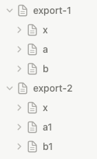

# export `Notion pages` to markdown files, based on [notion-sdk-py](https://github.com/ramnes/notion-sdk-py)
* only export page and it's sub-pages.
* supported notion block types currently.
  * paragraph
  * heading_1
  * heading_2
  * heading_3
  * numbered_list_item
  * bulleted_list_item (exclude: children bulleted_list_item)
  * image
  * code

## notion page tree

```text
export-1 (page_id: 8d5eee980f264dd28a6c07e8ecabbb3c)
    | - x
    | - a
    | - b
export-2 (page_id: 788d6c18679d4c4b9509b9db74f7fa28)
    | - x
    | - a1
    | - b1
```

## export steps
* go to [notion integration](https://www.notion.so/my-integrations), create or get your integration secret, assign to variable `NOTION_TOKEN` in main.py.

* go to `...` of each page you want to convert, add your integration to connections.

* get the page id of all pages your want to export, such as [8d5eee980f264dd28a6c07e8ecabbb3c, 788d6c18679d4c4b9509b9db74f7fa28], assign the ids to variable `PAGE_IDS` in main.py.

* assign the export output folder variable `EXPORT_FOLDER` in main.py.

* run main.py.

* output files int `EXPORT_FOLDER`(variable in main.py).
```text
[./export] $tree
.
|-- export-1
|   |-- a.md
|   |-- b.md
|   |-- x
|   |   `-- image_1.png
|   `-- x.md
`-- export-2
    |-- a1.md
    |-- b1
    |   |-- image_1.png
    |   `-- image_2.png
    |-- b1.md
    |-- x
    |   `-- image_1.png
    `-- x.md

5 directories, 10 files
```
